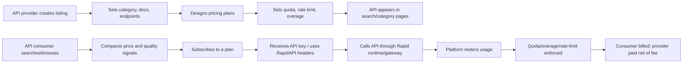

# RapidAPI 平台机制详细报告

生成日期：2026-06-14  
研究对象：RapidAPI / Rapid API Hub 公共 API 市场，重点是 `Data` 类别  
数据基础：RapidAPI `Data` 类别近全量横截面样本，以及 RapidAPI/Nokia 官方公开文档

## 一、核心结论

RapidAPI 是一个以 API 形式交易数据访问权的双边市场：一侧是 API 提供者，另一侧是 API 消费者/开发者。平台不是单纯的信息目录，而是同时承担目录搜索、订阅撮合、统一鉴权、调用转发、用量计量、计费、超额收费、卖家结算、质量信号展示和部分治理功能。

本文将 RapidAPI `Data` 类别界定为公开数据商品市场。普通 API 可以是功能服务、计算服务或软件接口；而 `Data` 类别中的 API 主要出售数据访问权。数据商品具有非竞争性、经验品属性、时效性、用途异质性和合规外部性。RapidAPI 的价格计划、免费试用、调用额度、超额费、速率限制、评分、订阅数和审批机制，正是平台将这些数据商品特征标准化为可交易合约的制度安排。

从机制上看，RapidAPI 把原本难以标准化的数据交易，拆成三个可度量对象：

1. 产品：一个 API，即 `api_id`。
2. 菜单：一个 API 下的多个价格计划，即 `plan_id`。
3. 用量规则：每个计划下的额度、限速、超额费用，即 `limit_id`。

这使得平台很适合做静态产业组织结构模型。数据 API 是差异化数据商品，卖家通过免费计划、分层套餐、额度、超额费、速率限制和审批机制，对不同用途、不同调用强度和不同合规风险的买家进行筛选；买家根据价格、质量、声誉、文档、额度、新鲜度和搜索曝光选择订阅。平台通过抽成、支付、流量费用和搜索/治理机制影响双方激励。

样本显示，在 RapidAPI `Data` 类别中：

- 发现公开 API：`6934` 个。
- 有效详情 API：`6898` 个，覆盖发现样本的 `99.48%`。
- API 提供者账户：约 `3837` 个。
- 价格计划：`23116` 条。
- 调用额度/超额费规则：`24867` 条。
- 公开且非隐藏的价格计划：`21086` 条。
- 价格计划中 `PUBLIC` 占 `93.43%`，`PRIVATE` 占 `6.57%`。
- 公开可见计划的月度价格中位数约为 `$12.99`；只看正价格计划，中位数约为 `$30`。

这些数字说明 RapidAPI 的交易机制不是“一个 API 一个价格”，而是“一个 API 多个套餐、多种用量边界、多层声誉信号”的菜单型市场。

## 二、数据商品属性与研究贡献

数据不同于普通数字服务。首先，数据具有非竞争性，同一份数据可以被多个买方同时使用而不被耗尽，这使数据交易更接近访问权销售而非所有权转移。Jones and Tonetti (2020) 将非竞争性作为数据经济的核心特征；这正对应 RapidAPI 的订阅制、调用额度和超额收费机制。

其次，数据质量具有经验品属性。买方在购买前难以完全验证数据的覆盖范围、准确性、新鲜度和适配性，这对应 Arrow (1962) 的信息悖论。RapidAPI 用免费计划、文档长度、评分、订阅数、平均延迟、成功率和服务水平来降低这种信息不对称。

再次，数据价值高度依赖下游用途。相同的 LinkedIn、地理位置、商品价格或房地产数据，对销售、风控、招聘、市场监测和 AI 应用的价值不同。Varian (1997) 关于信息商品版本化的理论，可以解释为什么卖家普遍使用 BASIC、PRO、ULTRA、MEGA 多档菜单，通过额度、rate limit 和超额费让买家自我选择。

最后，数据可能包含个人、企业或平台行为信息，存在隐私、产权和外部性。Acquisti, Taylor and Wagman (2016)、Choi, Jeon and Kim (2019)、Bergemann, Bonatti and Gan (2022) 都强调数据披露和数据转售可能产生外部性。这解释了为什么 RapidAPI 中存在审批、私有计划、terms of service、legal document 和定制合同。

因此，本文的边际贡献不是再次说明平台可以撮合买卖双方，而是提供一个公开数据商品市场的近全量微观证据：数据商品如何被包装为访问合约，如何通过价格、额度、超额费和声誉信号交易，均可在该市场中被系统性度量。

## 三、平台基本结构

RapidAPI 的公共市场可以理解为四层结构。

第一层是 API 产品层。API 提供者在 Studio/Hub Listing 中创建 API，填写名称、短描述、长描述、分类、logo、文档、端点、版本、定价和用量限制。官方文档说明，一个 API 必须被分配到单一类别，类别用于帮助用户在 Hub 中浏览和发现 API。

第二层是发现与展示层。消费者可以通过搜索、分类、标签和 API listing 页面发现 API。每个 API 页面一般包含概览、端点/文档、定价、讨论、评分、服务质量等信息。样本字段包含 `categoryName`、`tags`、`popularityScore`、`avgLatency`、`avgServiceLevel`、`avgSuccessRate`、`rating`、`ratingVotes`、`subscriptionsCount` 等信号。

第三层是订阅与调用层。消费者选择一个 pricing plan 后订阅 API。订阅后，消费者用 RapidAPI 提供的统一 key/header 进行调用。官方文档说明，如果 API 有定价，消费者通常需要先选择计划；价格基于月度订阅，并可能叠加超额费用。

第四层是计量、计费与结算层。平台根据计划规则计量请求数、额度、速率限制和超额调用。消费者可以通过 dashboard 或响应头查看剩余额度；API 提供者可以通过 Studio 查看使用情况。平台对通过 Hub 发生的支付收取 marketplace fee。

## 四、参与者与激励

### 1. API 提供者

API 提供者是平台的卖方。其核心决策包括：

- 是否上架 API。
- 选择 API 类别、标题、描述和文档。
- 选择免费、付费、freemium、per-use 或 tiered 定价。
- 设计 BASIC、PRO、ULTRA、MEGA 或自定义计划。
- 设定每个计划的月费、额度、速率限制和超额单价。
- 是否设置推荐计划。
- 是否要求买家申请批准。
- 是否使用 private/custom plan 给特定买家报价。

数据中卖家高度分散。`Data` 类别的 `6898` 个有效 API 来自约 `3837` 个 owner。头部卖家拥有较多 API，例如 `skdeveloper`、`ksdeveloper`、`APICrafterPro`、`apidevpro` 等，但多数卖家只发布少数 API。这意味着市场同时存在长尾卖家和多产品卖家，后者适合在结构模型中考虑 firm fixed effects 或 owner-level portfolio effects。

### 2. API 消费者

API 消费者是买方，通常是开发者、企业或数据产品构建者。其选择过程大致为：

1. 搜索或浏览某类 API。
2. 比较 API 的名称、描述、文档、评分、成功率、延迟、订阅数和价格。
3. 选择一个计划并订阅。
4. 使用 API key 调用。
5. 在使用中受到额度、速率限制和超额费约束。

消费者面对的不是单一价格，而是套餐菜单。免费计划降低试用成本；低价计划适合测试和小规模使用；高价或大额度计划面向高需求用户；soft limit 和 overage fee 允许超额使用；hard limit 则直接限制使用。

### 3. 平台方

平台方的角色不是中性的目录管理员，而是交易基础设施提供者。其机制包括：

- 维护 API Hub 和搜索/分类系统。
- 提供统一认证、调用入口和 SDK/header 规范。
- 支持订阅、计费、超额费、发票和支付。
- 对交易收取 marketplace fee。
- 提供用量可视化、响应头、开发者 dashboard。
- 支持卖家设置价格、额度、限速、审批和推荐计划。
- 对企业场景提供 API Hub、治理、生命周期管理等能力。

Nokia 于 2024-11-13 宣布收购 Rapid 的技术资产和研发团队，官方公告称 Rapid 技术包括公共市场、企业服务和企业级 API hub。这个背景说明 RapidAPI 现在不仅是公共 API 市场，也被纳入更大的网络 API 和企业 API 生态。

## 五、搜索、分类与曝光机制

RapidAPI 的发现机制可以分为平台可见机制与不可见机制。

可见机制包括：

- 类别：如 `Data`、`Finance`、`AI` 等。本文样本限定在 `Data` 类别。
- 搜索关键词：搜索页返回 API 列表。
- 标签：API version 中包含 tags。
- listing 信息：名称、标题、短描述、thumbnail、owner。
- 可见质量信号：评分、投票数、延迟、服务水平、成功率、人气分。
- 价格标签：`FREE`、`FREEMIUM`、`PAID` 等。

不可见机制包括：

- 排名算法如何加权相关性、人气、质量、更新频率和商业因素。
- `popularityScore` 的具体计算公式。
- 订阅数是否直接影响排序。
- 平台是否对某些 API 做人工或商业推广。

从研究设计看，搜索页展示的是窗口化结果，不等于数据库全量枚举。本文使用近全量横截面样本，是为了避免只观察头部搜索结果带来的选择偏差。

## 六、定价菜单机制

RapidAPI 的定价机制是平台最重要的经济机制。

### 1. 计划层级

一个 API 可以有多个价格计划。常见计划名称包括：

- `BASIC`
- `PRO`
- `ULTRA`
- `MEGA`
- `CUSTOM-*`

本地数据中，计划名称高度标准化：

- `BASIC`：`6892` 条。
- `PRO`：`5518` 条。
- `ULTRA`：`4959` 条。
- `MEGA`：`4217` 条。

这说明 RapidAPI 的菜单设计有明显的平台模板特征：大量 API 使用 BASIC/PRO/ULTRA/MEGA 的四档菜单。这为研究“菜单复杂度”“二级价格歧视”“版本化定价”提供了很好的实证对象。

### 2. 价格类型

样本中的 `23116` 条价格计划中：

| 计划定价类型 | 行数 | 占比 |
|---|---:|---:|
| PAID | 15904 | 68.80% |
| FREE | 5969 | 25.82% |
| FREEMIUM | 904 | 3.91% |
| PERUSE | 317 | 1.37% |
| TIERS | 20 | 0.09% |

在 API 产品层，`Data` 类别的定价标签为：

| API 定价标签 | API 数 | 占比 |
|---|---:|---:|
| FREEMIUM | 4815 | 69.80% |
| FREE | 1319 | 19.12% |
| PAID | 764 | 11.08% |

产品层大量 API 被标记为 FREEMIUM，但计划层多数计划是 PAID。这说明平台上的 freemium 机制通常不是“全部免费”，而是“API 有免费入口，同时提供付费升级计划”。

### 3. 免费计划

免费计划的作用是降低试用门槛。官方文档说明，免费 API 计划存在请求限制，例如每小时和每月请求上限；如果超过速率限制，消费者会收到 `429 Too Many Requests`。这使免费计划在经济上承担“试用/获客”功能，而不是无限免费供给。

### 4. 公开计划与私有计划

价格计划有 `PUBLIC` 与 `PRIVATE` 两类：

| 可见性 | 行数 | 占比 |
|---|---:|---:|
| PUBLIC | 21598 | 93.43% |
| PRIVATE | 1518 | 6.57% |

公开计划是普通消费者在 API 页面上可见并可选择的价格菜单；私有计划更像定制合同、内部测试、指定客户报价或企业协商价。实证主样本应优先使用：

```text
is_public_plan == True
is_hidden_plan == False
api_status == "ACTIVE"
```

当前公开且非隐藏的计划有 `21086` 条，覆盖 `6893` 个 API，平均每个 API 约 `3.06` 个公开可见计划。

### 5. 价格分布

公开且非隐藏计划的月度价格分布如下：

- 中位数：`$12.99`。
- 75 分位数：`$59.99`。
- 90 分位数：`$199.99`。
- 95 分位数：`$500`。
- 99 分位数：`$3300`。

只看正价格计划：

- 中位数：`$30`。
- 75 分位数：`$100`。
- 90 分位数：`$299`。
- 95 分位数：`$500`。

价格右尾非常长，最大值达到极高水平。论文中建议对价格取 `log(1+price)`，并在稳健性检验中 winsorize 99% 或 99.5% 分位。

## 七、额度、速率限制与超额费机制

RapidAPI 的“价格”并不只是月费，还包括额度和超额费。一个计划下可能有多个 `billinglimits`，分别约束 Requests、Credits 或其他 billing item。

### 1. hard limit 与 soft limit

样本中的 `24867` 条额度规则中：

| limit 类型 | 行数 | 占比 |
|---|---:|---:|
| hard | 14816 | 59.58% |
| soft | 8011 | 32.22% |
| 空/未标明 | 2040 | 8.20% |

hard limit 通常意味着消费者达到额度后不能继续使用，或者会被平台限制；soft limit 则更接近“可超额使用并收费”。这两类规则对消费者需求的含义不同：

- hard limit 是数量约束。
- soft limit 是两部制价格中的边际价格机制。

### 2. quota amount

公开可见计划下的额度数量分布：

- 中位数：`5000`。
- 75 分位数：`100000`。
- 90 分位数：`500000`。
- 99 分位数：`2000000`。

额度单位可能是 Requests、Credits 或其他 billing item，因此不能简单把所有 amount 当作同质请求数。实证中可做两种处理：

1. 主样本只保留 `billingitem_name == "Requests"` 或 `allEndpoints == True` 的额度。
2. 稳健性检验使用所有额度，并加入 billing item 类型固定效应。

### 3. overage price

公开可见计划中，正的超额费中位数约为 `0.01`，75 分位数约为 `0.05`，90 分位数约为 `0.10`。这说明大量 API 采用“低月费 + 额度 + 边际超额费”的两部制价格。

官方文档还说明，当消费者超过计划 quota limit 时，可能产生 overage fees；消费者可以在 dashboard 或 response headers 中查看使用量和剩余额度。官方 response header 文档中也说明了 `x-ratelimit-requests-remaining` 和 `x-ratelimit-requests-reset` 的作用。

### 4. rate limit

rate limit 是单位时间调用频率限制。官方文档说明，卖家可以为每个计划单独设置速率限制，单位可以是秒、分钟或小时；如果超过 rate limit，消费者会收到 `429 Too Many Requests`。这意味着套餐不仅约束总量，还约束调用强度。

在经济含义上，rate limit 是一种质量/容量限制：

- 对高频用户，rate limit 降低计划吸引力。
- 对卖家，rate limit 可以控制服务器成本和拥塞风险。
- 对平台，rate limit 有助于防止滥用和维持可靠性。

## 八、审批、推荐与私有合同机制

RapidAPI 的价格菜单还包含非价格摩擦。

### 1. Require approval

卖家可以设置某个计划需要批准。官方文档说明，若计划勾选 require approval，消费者必须提交申请并回答卖家设置的问题，卖家之后批准或拒绝。

经济含义：

- 卖家可以筛选客户，避免滥用。
- 高价值或敏感数据 API 可以采用审批机制。
- 审批增加交易摩擦，可能降低转化率，但提高匹配质量。

数据字段包括：

- `shouldRequestApproval`
- `requires_approval`
- `requestApprovalQuestion`

### 2. Recommended plan

卖家可以标记推荐计划。官方文档说明，推荐计划会在消费者看到的 pricing tab 中带有 Recommended 标签。

经济含义：

- 推荐计划是默认效应/锚定效应机制。
- 卖家可以引导消费者选择利润更高或更稳定的中档计划。
- 可以在实证中检验推荐计划是否对应更高价格、更大额度或更优质量。

数据字段包括：

- `recommended`
- `is_recommended_plan`

### 3. Private/custom plan

本地数据中有 `1518` 条 private plan，占全部计划的 `6.57%`。大量计划名称带有 `CUSTOM-*`。这些计划不适合直接解释为公开市场价格，但很适合做附录分析：

- 是否头部卖家更常使用 private plan。
- 高订阅 API 是否更常出现 custom plan。
- private plan 是否价格更高、额度更大。
- private plan 是否体现 B2B 协商和价格歧视。

## 九、声誉与质量信号机制

RapidAPI 的一个关键机制是把 API 质量转化为可比较信号。样本中可观测的主要信号包括：

- `subscriptionsCount`：订阅数。
- `rating`：用户评分。
- `ratingVotes`：评分票数。
- `popularityScore`：人气分。
- `avgLatency`：平均延迟。
- `avgServiceLevel`：平均服务水平。
- `avgSuccessRate`：平均成功率。
- `readme_len`：文档长度。
- `longDescription_len`：长描述长度。

这些信号解决数据/API 市场中的典型信息不对称问题。API 消费者在购买前难以知道真实质量，平台通过评分、使用量、性能指标和文档披露降低逆向选择。

本地数据中：

- 订阅数中位数为 `4`，均值约 `174`，99 分位数约 `2271`，最大值 `49780`。
- `popularityScore` 有值样本的中位数为 `8.7`，高分 API 很多。
- `avgServiceLevel` 中位数为 `100`。
- `avgSuccessRate` 中位数为 `99`。
- `avgLatency` 中位数约 `1032` 毫秒，但右尾很长。

注意：评分变量存在异常值和大量零值，论文中应先清洗为 `0 <= rating <= bestRating`，并把 `ratingVotes == 0` 的评分视为弱信号或缺失信号。

## 十、平台抽成与支付机制

RapidAPI 官方 payout 文档说明，从 2025-11-15 起，Rapid 对通过 API Hub 发生的支付收取 `25%` marketplace fee。这个费用覆盖支付处理、平台基础设施和行政成本，但不包括 PayPal payout 的相关费用。

这意味着卖家面对的是净收入：

```text
provider_revenue = gross_payment * (1 - marketplace_fee) - external_payout_costs
```

如果 marketplace fee 为 25%，则卖家从 100 美元订阅收入中获得约 75 美元，未计额外 payout 成本。

对产业组织模型而言，这相当于平台在供给侧加入一个 ad valorem tax 或平台佣金：

```text
net_price_jk = (1 - τ) * price_jk
τ = 0.25
```

卖家的最优定价条件应使用净价格，而消费者需求仍由毛价格决定。这会影响价格-成本边际和反事实平台佣金分析。

## 十一、交易流程机制

一个典型交易流程如下：



该流程体现三重撮合：

1. 信息撮合：搜索、类别、标签、文档和声誉信号。
2. 合同撮合：计划、额度、超额费、审批、私有计划。
3. 技术撮合：统一 key、调用网关、响应头、用量计量。

## 十二、平台机制与实证模型的连接

### 1. 产品市场定义

当前建议把 `Data` 类别作为一个宽市场，并用 tags、文本、owner 或子类别构造更细市场。基础单位为：

```text
产品 j = api_id
卖家 f = owner_slugifiedName 或 parent_org_slugifiedName
计划 k = plan_id
额度规则 l = limit_id
```

### 2. 需求侧

如果使用 API 层订阅数作为需求代理，可以构造：

```text
log(1 + subscriptions_j)
  = β0
  + β1 log(1 + min_public_price_j)
  + β2 has_free_plan_j
  + β3 log(1 + max_quota_j)
  + β4 reputation_j
  + β5 quality_j
  + β6 documentation_j
  + owner controls
  + tag/category controls
  + ε_j
```

其中：

- `subscriptions_j`：`subscriptionsCount`。
- `min_public_price_j`：API 的最低公开正月费，或推荐计划价格。
- `has_free_plan_j`：是否有免费公开计划。
- `max_quota_j`：公开计划中的最大额度。
- `reputation_j`：`rating`、`ratingVotes`、`popularityScore`。
- `quality_j`：`avgSuccessRate`、`avgServiceLevel`、`avgLatency`。
- `documentation_j`：`readme_len`、`longDescription_len`。

### 3. 菜单设计模型

计划层可以研究卖家如何设计价格菜单：

```text
price_jk
  = α0
  + α1 quota_jk
  + α2 overage_jk
  + α3 rate_limit_jk
  + α4 reputation_j
  + α5 provider_portfolio_f
  + μ_f
  + η_jk
```

或研究计划数量：

```text
plan_count_j
  = g(reputation_j, subscriptions_j, provider_size_f, api_age_j, category/tag_j)
```

直觉是：高需求、高质量或更成熟的 API 更可能设计多档计划，以进行二级价格歧视。

### 4. 结构模型

一个静态离散选择模型可以写为：

```text
u_ijk = δ_j + α price_jk + β quota_jk + γ overage_jk + θ quality_j + ρ reputation_j + ξ_jk + ε_ijk
```

其中消费者选择 API-plan 组合。由于目前没有 plan-level subscription share，主模型可先把每个 API 聚合为一个产品，使用最低公开价格、免费入口、最大额度和质量声誉作为产品属性；计划层模型作为供给侧菜单设计或机制补充。

### 5. 供给侧

考虑平台抽成后，卖家面对的净价格为：

```text
p_net = (1 - τ) p_gross
```

若 τ = 25%，则平台抽成会压低卖家边际收益。若未来做反事实，可以模拟：

- 平台佣金下降是否降低 API 价格。
- 免费计划限制变化是否影响 freemium 策略。
- 搜索排序权重变化是否改变头部集中度。

## 十三、数据结构与文件说明

当前最重要的数据文件是：

- `rapidapi_crawl/data/rapidapi_discovery_Data_apis.csv`：搜索发现层 API 主表。
- `rapidapi_crawl/data/用所选项目新建的文件夹/rapidapi_details_Data_apis.csv`：详情层 API 表。
- `rapidapi_crawl/data/用所选项目新建的文件夹/rapidapi_details_Data_billing_plans.csv`：价格计划表。
- `rapidapi_crawl/data/用所选项目新建的文件夹/rapidapi_details_Data_billing_limits.csv`：额度与超额费表。
- `rapidapi_crawl/data/用所选项目新建的文件夹/rapidapi_panel_Data_plan.csv`：API × plan 面板。
- `rapidapi_crawl/data/用所选项目新建的文件夹/rapidapi_panel_Data_plan_limit.csv`：API × plan × limit 面板。
- `rapidapi_crawl/data/用所选项目新建的文件夹/rapidapi_panel_Data_variable_dictionary.md`：中文变量字典。

建议论文主样本使用：

```text
rapidapi_panel_Data_plan.csv
where is_public_plan == True
  and is_hidden_plan == False
  and api_status == "ACTIVE"
```

如研究额度和超额费，则使用：

```text
rapidapi_panel_Data_plan_limit.csv
where is_public_plan == True
  and is_hidden_plan == False
```

## 十四、数据质量与限制

1. 本数据是 2026-06-14 的横截面，不能直接识别动态因果效应。
2. 当前只覆盖 `Data` 类别，不能直接外推到所有 API 类别。
3. 搜索页结果存在展示窗口和排序选择，单页搜索结果不能代表总体市场。
4. 有 36 个搜索层记录没有可用详情页，基本可视为索引残留或不可用详情页。
5. 订阅数是 API 层变量，不是 plan 层销量。
6. 没有真实交易金额、卖家成本、消费者身份和实际调用量。
7. 私有计划可能是定制合同，不应直接混入公开市场价格主回归。
8. 评分存在异常值和零票评分，需清洗。
9. 额度单位不完全一致，Requests、Credits 和其他 billing item 应分开处理或加固定效应。
10. 排序算法不可见，因此 search rank 只能作为曝光代理，不能直接解释为平台偏好。

## 十五、论文中可讲的机制故事

最适合写成论文的机制是：

> 数据/API 产品具有严重的信息不对称和使用强度异质性。RapidAPI 通过统一的套餐化交易机制，把 API 交易标准化为“订阅费 + 调用额度 + 超额费 + 速率限制 + 声誉信号”的组合合同。卖家利用多档计划进行筛选和价格歧视；买家利用声誉和质量信号降低试错成本；平台通过搜索、计量、结算和抽成内生地影响市场结构。

这个机制可以落到三类实证问题：

1. 声誉是否提高卖家的定价能力？
2. 免费计划是否提高订阅采用量，并通过付费升级变现？
3. 多档菜单是否主要出现在高质量、高订阅或多产品卖家中？

## 十六、参考来源

- RapidAPI Documentation, API Hub Consumer Quick Start Guide: https://docs.rapidapi.com/docs/consumer-quick-start-guide
- RapidAPI Documentation, API Listing Overview: https://docs.rapidapi.com/docs/api-listing-overview
- RapidAPI Documentation, Hub Listing - General Tab: https://docs.rapidapi.com/docs/hub-listing-general-tab
- RapidAPI Documentation, Hub Listing - Monetize Tab: https://docs.rapidapi.com/docs/hub-listing-monetize-tab
- RapidAPI Documentation, Monetizing Your API on rapidapi.com: https://docs.rapidapi.com/docs/monetizing-your-api-on-rapidapicom
- RapidAPI Documentation, Payouts and Finance: https://docs.rapidapi.com/docs/payouts-and-finance
- RapidAPI Documentation, Response Headers: https://docs.rapidapi.com/docs/response-headers
- RapidAPI Documentation, Connecting to an API: https://docs.rapidapi.com/docs/connecting-to-an-api
- RapidAPI Documentation, Architecture Overview and Deployment Options: https://docs.rapidapi.com/docs/architecture-overview-and-deployment-options
- Nokia Press Release, Nokia acquires Rapid technology and R&D unit: https://www.nokia.com/newsroom/nokia-acquires-rapid-technology-and-rd-unit-to-strengthen-development-of-network-api-solutions-and-ecosystem/
