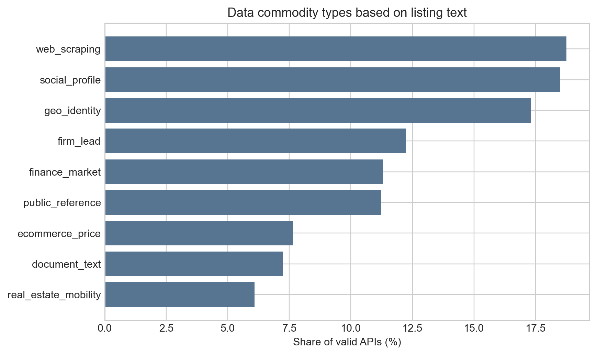
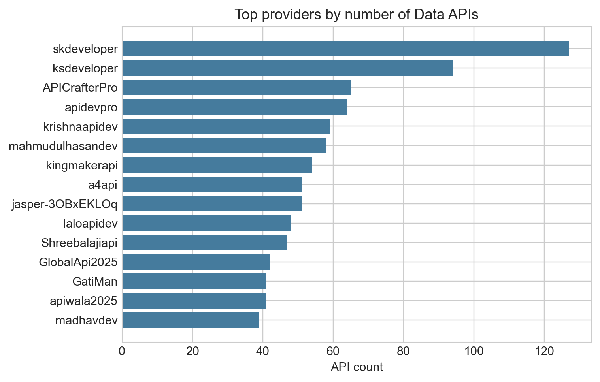
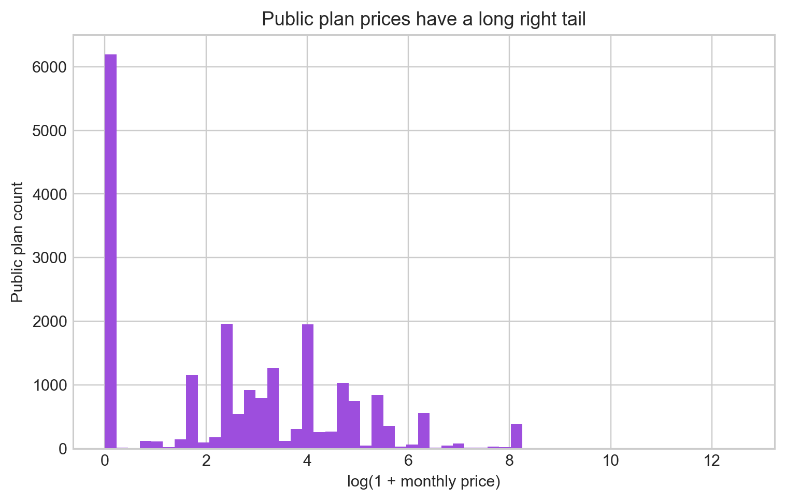
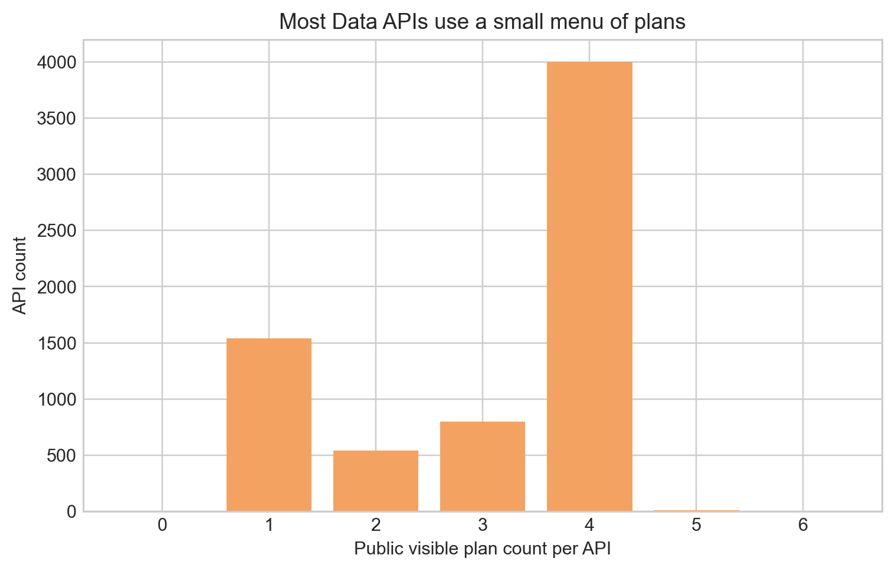
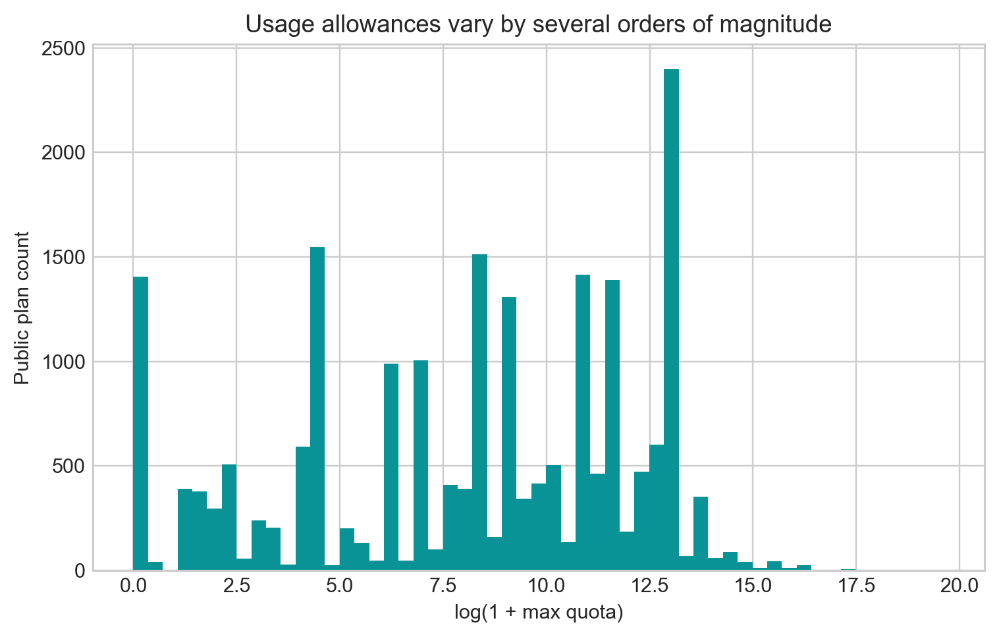
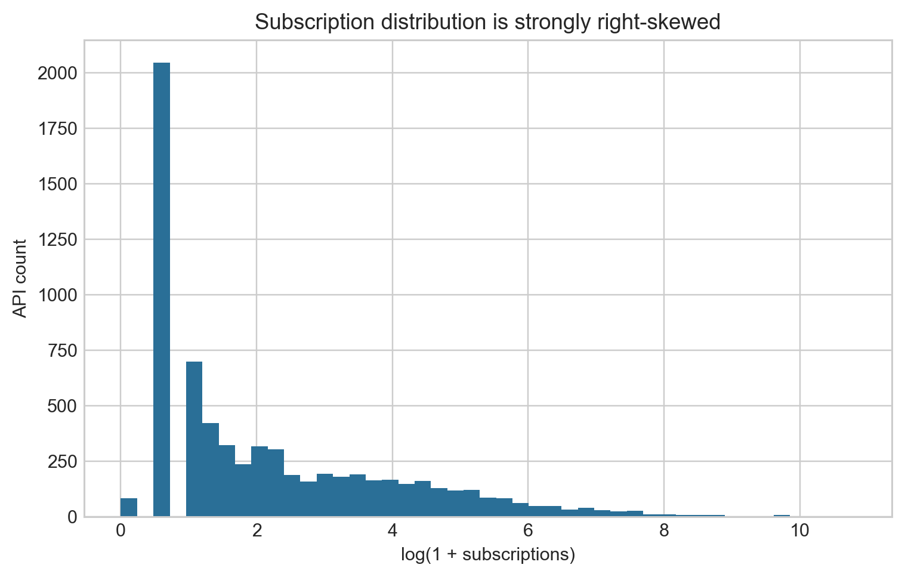
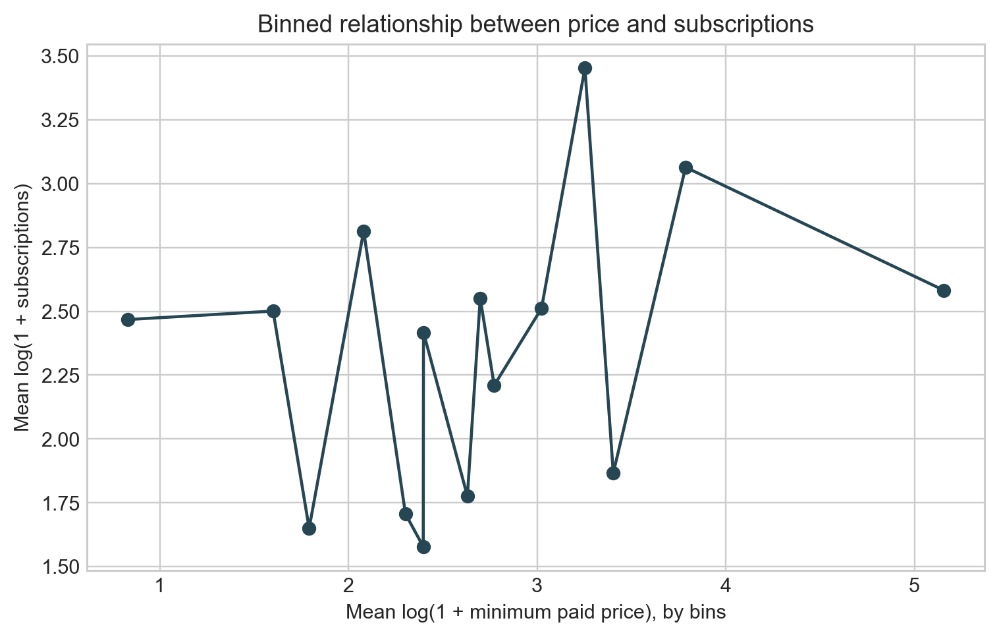

\newpage

# 摘要

本文基于 RapidAPI `Data` 类别近全量横截面样本，分析数据商品在平台市场中的基本面结构、价格菜单、调用额度、声誉质量信号以及 reduced form 相关关系。样本包含 `6898` 个有效 API、`23116` 条价格计划和 `24867` 条调用额度/超额费规则。核心发现是：Data API 不是普通软件服务，而是被平台标准化为“访问权 + 调用额度 + 超额费 + 声誉信号”的数据商品。公开非隐藏计划共有 `21086` 条，API 层最低正月费中位数约为 `9.99`，订阅数中位数为 `4`，公开计划数中位数为 `4`。

Reduced form 结果显示：免费计划与更高订阅量显著正相关；最低付费价格对订阅量的系数较小，加入质量控制后为负但不稳定；API 层最大公开额度与订阅量负相关，但与价格和菜单复杂度正相关；在计划层面，同一 API 内部，额度更大的计划价格显著更高。这些结果支持“数据商品通过免费试用、分层菜单和用量边界实现筛选与价格歧视”的解释，也提醒我们不能把额度简单理解为无条件提高需求的质量指标。本文不作强因果识别，而是把这些回归作为平台机制和结构模型设定的事实基础。

# 1. 样本与研究单位

研究单位分为三层：API 产品层、价格计划层、调用额度层。API 产品层用于研究数据商品的需求采用和声誉质量；价格计划层用于研究菜单和价格；调用额度层用于研究用量边界、hard/soft limit 和超额费。

| 指标 | 数值 |
|---|---|
| 有效 API | 6898 |
| API 提供者 owner | 3837 |
| 父组织 parent org | 1003 |
| 价格计划 | 23116 |
| 公开非隐藏价格计划 | 21086 |
| 调用额度/超额费规则 | 24867 |
| 有公开计划的 API | 6893 |
| 有额度规则的 API | 6882 |

主分析样本使用公开且非隐藏计划，即 `is_public_plan == True` 且 `is_hidden_plan == False`。私有计划更接近定制合同或指定客户报价，不作为公开市场价格的主口径。

# 2. 数据商品类型

RapidAPI `Data` 类别覆盖多种数据商品，包括网页抽取、社交画像、地理身份查询、企业线索、金融市场、电商价格、文档文本和房地产/出行数据。分类基于 API 名称、slug、描述和标签的关键词识别，类别可重叠。

| 数据商品类型 | API 数 | 占比 |
|---|---|---|
| web_scraping | 1294 | 0.188 |
| social_profile | 1277 | 0.185 |
| geo_identity | 1195 | 0.173 |
| firm_lead | 843 | 0.122 |
| finance_market | 780 | 0.113 |
| public_reference | 774 | 0.112 |
| ecommerce_price | 528 | 0.077 |
| document_text | 500 | 0.072 |
| real_estate_mobility | 420 | 0.061 |



该结构说明，样本不是普通 API 服务集合，而是下游企业把数据作为输入品购买的多类型市场。不同类型的数据在覆盖范围、实时性、合规风险和下游用途上存在差异，这也是后续结构模型需要控制细分市场差异的原因。

# 3. 平台供给与卖家结构

样本中 API 提供者数量较多，长尾特征明显。头部卖家拥有数十到上百个 API，但总体上市场仍高度分散。多产品卖家可能拥有更强的产品组合能力、模板化定价能力和搜索曝光优势。

| owner_slugifiedName | api_count | total_subscriptions | mean_subscriptions |
|---|---|---|---|
| skdeveloper | 127 | 1188 | 9.35 |
| ksdeveloper | 94 | 1083 | 11.52 |
| APICrafterPro | 65 | 317 | 4.88 |
| apidevpro | 64 | 301 | 4.70 |
| krishnaapidev | 59 | 235 | 3.98 |
| mahmudulhasandev | 58 | 1256 | 21.66 |
| kingmakerapi | 54 | 296 | 5.48 |
| jasper-3OBxEKLOq | 51 | 96 | 1.88 |
| a4api | 51 | 198 | 3.88 |
| laloapidev | 48 | 195 | 4.06 |
| Shreebalajiapi | 47 | 216 | 4.60 |
| GlobalApi2025 | 42 | 210 | 5.00 |



# 4. 价格与菜单基本面

Data API 的交易不是一个 API 一个价格，而是一个 API 对应多个公开计划。BASIC、PRO、ULTRA、MEGA 等计划名称高度常见，说明卖家普遍采用信息商品版本化和二级价格歧视。

## 4.1 API 和计划定价类型

API 产品层以 FREEMIUM 为主，计划层则以 PAID 计划为主。这表明 freemium 的实际含义通常是“有免费入口，同时通过付费计划变现”。

| API 定价标签 | API 数 | 占比 |
|---|---|---|
| FREEMIUM | 4815 | 0.698 |
| FREE | 1319 | 0.191 |
| PAID | 764 | 0.111 |

| 计划定价类型 | 计划数 | 占比 |
|---|---|---|
| PAID | 15904 | 0.688 |
| FREE | 5969 | 0.258 |
| FREEMIUM | 904 | 0.039 |
| PERUSE | 317 | 0.014 |
| TIERS | 20 | 0.001 |
|  | 2 | 0.000 |

| 计划可见性 | 计划数 | 占比 |
|---|---|---|
| PUBLIC | 21598 | 0.934 |
| PRIVATE | 1518 | 0.066 |

## 4.2 价格分布

公开计划价格右偏明显，存在少数极高价格计划。报告中的回归对价格使用 `log(1+price)`，并在计划层使用 1%/99% winsorized 价格减少极端值影响。

| 变量 | N | 均值 | 标准差 | P25 | P50 | P75 | P90 | P99 |
|---|---|---|---|---|---|---|---|---|
| 公开计划月费 | 20840 | 187.62 | 3588.17 | 0.00 | 12.99 | 59.99 | 199.99 | 3300.00 |
| 计划最大额度 | 21069 | 219214.66 | 3591375.10 | 100.00 | 5000.00 | 100000.00 | 500000.00 | 2000000.00 |
| 平均超额费 | 20097 | 430.36 | 60958.17 | 0.00 | 0.00 | 0.00 | 0.03 | 0.99 |
| 额度规则数 | 21086 | 1.06 | 0.45 | 1.00 | 1.00 | 1.00 | 1.00 | 2.00 |
| 功能项数 | 21086 | 0.33 | 1.42 | 0.00 | 0.00 | 0.00 | 0.00 | 7.00 |





# 5. 用量、额度和超额费

数据商品的核心不是所有权转移，而是可计量访问权。平台将访问权转化为请求数、额度、速率限制和超额费。公开计划的额度跨越多个数量级，说明买家使用强度差异很大，卖家通过套餐大小筛选不同需求类型。



hard limit 更接近数量约束，soft limit 更接近允许超额使用并收费的两部制价格。对结构模型而言，价格不应只用月费，还应同时纳入额度和超额费。

# 6. 声誉、质量与采用

API 订阅数和评分信号高度右偏。许多 API 订阅数很低，少数头部 API 获得大量订阅。这符合数据商品的经验品特征：买方在购买前难以完全验证数据质量，因此依赖订阅数、评分、成功率、延迟和文档等信号。

| 变量 | N | 均值 | 标准差 | P25 | P50 | P75 | P90 | P99 |
|---|---|---|---|---|---|---|---|---|
| 订阅数 | 6898 | 174.24 | 1561.41 | 1.00 | 4.00 | 29.00 | 149.00 | 2271.48 |
| 公开计划数 | 6898 | 3.06 | 1.25 | 2.00 | 4.00 | 4.00 | 4.00 | 4.00 |
| 最低正月费 | 5316 | 48.97 | 1390.87 | 5.00 | 9.99 | 15.00 | 29.99 | 300.00 |
| 正价计划中位月费 | 5316 | 110.31 | 1403.63 | 19.99 | 49.00 | 69.99 | 257.50 | 885.00 |
| 最大公开额度 | 6881 | 543508.67 | 6228837.93 | 5000.00 | 127564.00 | 500000.00 | 500000.00 | 5000000.00 |
| 评分 | 6892 | 1.91 | 2.36 | 0.00 | 0.00 | 5.00 | 5.00 | 5.00 |
| 评分票数 | 6898 | 1.83 | 20.24 | 0.00 | 0.00 | 1.00 | 2.00 | 24.00 |
| 人气分 | 2455 | 6.78 | 3.85 | 2.30 | 8.70 | 9.30 | 9.70 | 9.90 |
| 平均延迟 | 2455 | 6292.94 | 23761.17 | 376.00 | 1032.00 | 2780.00 | 9151.20 | 130770.40 |
| 成功率 | 2455 | 70.08 | 41.59 | 29.00 | 99.00 | 100.00 | 100.00 | 100.00 |
| 文档长度 | 6898 | 640.89 | 3324.88 | 0.00 | 3.00 | 28.00 | 1526.30 | 11950.62 |
| API 年龄天数 | 6898 | 766.33 | 939.18 | 111.00 | 326.00 | 1233.75 | 1866.60 | 4559.09 |





# 7. Reduced Form 回归设计

回归结果均解释为相关关系，不作因果解释。核心目标是回答三个问题：

1. 哪些数据商品属性与更高采用量相关？
2. 哪些属性与更高价格相关？
3. 多档菜单和额度设计是否体现数据商品的筛选机制？

API 层被解释变量包括 `log(1+subscriptions)`、`log(1+minimum paid price)`、是否有免费计划、公开计划数量。计划层被解释变量为 `log(1+plan monthly price)`。标准误在 API 层使用 heteroskedasticity-robust，在计划层按 API 聚类。计划层还报告同一 API 内部的 within-API 规格。

# 8. 回归结果

## 8.1 API 采用量

| 变量 | API demand: baseline | API demand: with quality |
|---|---|---|
| Has free public plan | 1.287*** (0.058) | 1.096*** (0.174) |
| Log min paid price | 0.010 (0.018) | -0.029 (0.026) |
| Log max quota | -0.020*** (0.005) | -0.031*** (0.008) |
| Log public plan count | 0.522*** (0.083) | -0.069 (0.118) |
| Popularity score |  | 0.194*** (0.019) |
| Success rate |  | -1.494*** (0.175) |
| Log latency |  | 0.010 (0.012) |
| Rating |  | -0.122*** (0.012) |
| Log rating votes |  | 1.029*** (0.037) |
| Log readme length | 0.112*** (0.008) | 0.011 (0.008) |
| Log API age | 0.653*** (0.015) | 0.791*** (0.017) |
| Log owner API count | -0.155*** (0.015) | -0.102*** (0.019) |
| Has soft limit | -0.052 (0.041) |  |
| N | 6898 | 2449 |
| R-squared | 0.365 | 0.708 |

主要结果：

- 免费公开计划与更高订阅量正相关，符合数据商品需要试用入口来缓解质量不确定性的机制。
- 最低付费价格对订阅量的系数较小，加入质量变量后为负但不显著；价格-采用关系需要谨慎解释。
- 公开计划数量和文档长度在基准规格中与订阅量正相关；最大额度在 API 层与订阅量负相关，可能反映高额度产品面向更窄、更高强度的需求场景。
- 加入质量变量后，人气分、评分票数、成功率和延迟等指标解释订阅差异，表明声誉质量信号是数据商品交易的重要机制。

## 8.2 API 价格、免费计划和菜单复杂度

| 变量 | API price: minimum paid plan | Free plan adoption: LPM | Menu complexity |
|---|---|---|---|
| Has free public plan |  |  | 0.021 (0.014) |
| Log max quota | 0.025*** (0.008) | 0.000 (0.001) | 0.045*** (0.001) |
| Log public plan count | -0.076 (0.124) | 0.021 (0.014) |  |
| Log subscriptions | 0.045*** (0.009) | 0.043*** (0.002) | 0.017*** (0.002) |
| Log readme length | 0.014*** (0.005) | -0.015*** (0.001) | 0.009*** (0.001) |
| Log API age | -0.005 (0.011) | -0.003 (0.003) | -0.015*** (0.003) |
| Log owner API count | -0.020* (0.010) | 0.014*** (0.003) | 0.051*** (0.003) |
| Has soft limit | -0.124*** (0.027) |  |  |
| N | 5316 | 6898 | 6898 |
| R-squared | 0.040 | 0.270 | 0.502 |

主要结果：

- 订阅量与最低付费价格正相关，说明被采用更多的数据商品具有更强定价能力。
- 最大额度与价格正相关，体现数据访问权的套餐大小定价。
- 免费计划与菜单复杂度关系密切：freemium 常与多档付费升级计划共同出现。

## 8.3 计划层价格与额度

| 变量 | Plan price: pooled | Plan price: within API |
|---|---|---|
| Log subscriptions | -0.057*** (0.007) |  |
| Popularity score | 0.012 (0.012) |  |
| Success rate | -0.142 (0.106) |  |
| Log latency | -0.004 (0.005) |  |
| Log readme length | 0.066*** (0.004) |  |
| Log owner API count | 0.093*** (0.008) |  |
| Log plan quota | 0.059*** (0.004) | 0.148*** (0.005) |
| Has soft limit | 0.169 (0.212) | 0.974*** (0.332) |
| Positive overage fee | -0.265 (0.212) | -1.324*** (0.332) |
| Recommended plan | 0.190*** (0.018) | 0.096*** (0.010) |
| Plan tier: PRO | 2.077*** (0.021) | 1.805*** (0.026) |
| Plan tier: ULTRA | 3.277*** (0.030) | 2.818*** (0.037) |
| Plan tier: MEGA | 4.337*** (0.037) | 3.735*** (0.046) |
| N | 20840 | 19306 |
| R-squared | 0.780 | 0.913 |

主要结果：

- 计划额度越大，月费越高；该关系在 pooled 和 within-API 规格中均成立。
- 同一 API 内部，PRO、ULTRA、MEGA 等高阶计划相对于基础计划显著更贵，符合信息商品版本化定价。
- soft limit 和正超额费反映不同的边际使用约束，与月费之间存在系统性相关。

# 9. 对结构模型的启发

本数据适合从静态差异化产品模型出发。API 是产品，owner 是企业，公开计划是价格菜单，订阅数是采用量代理。一个可行的 API 层需求式为：

```text
log(1 + subscriptions_j)
  = β price_j + γ quota_j + θ reputation_j
  + λ quality_j + δ data_type_j + μ owner_controls_j + ε_j
```

如果进一步使用 plan 层，则可把每个 API-plan 视为一个版本化产品：

```text
u_ijk = α price_jk + β quota_jk + γ overage_jk
        + θ quality_j + ρ reputation_j + ξ_jk + ε_ijk
```

由于目前没有 plan-level subscription share，主报告建议先做 API 层需求和 plan 层供给/菜单设计的 reduced form，再在结构模型中将计划菜单聚合为 API 产品属性。

# 10. 局限与后续工作

1. 样本为横截面，不能识别动态进入、学习和声誉积累。
2. 订阅数是 API 层采用量代理，不是实际调用量或销售额。
3. 没有消费者身份、真实成交金额、卖家成本和平台排序算法。
4. 私有计划更像定制合同，应与公开计划分开分析。
5. 额度单位存在 Requests、Credits、Rows、Searches 等差异，后续可进一步限制到 Requests 口径。
6. Reduced form 结果是相关关系，后续需要结合工具变量、自然实验或结构模型做更强识别。

# 11. 输出文件

- 清洗后 API 层样本：`rapidapi_analysis/data/api_level.csv`
- 清洗后公开计划层样本：`rapidapi_analysis/data/public_plan_level.csv`
- 描述统计表：`rapidapi_analysis/tables/`
- 图表：`rapidapi_analysis/figures/`
- Stata 复跑脚本：`rapidapi_analysis/scripts/run_reduced_form.do`
- Stata 回归日志：`rapidapi_analysis/tables/stata_reduced_form.log`

