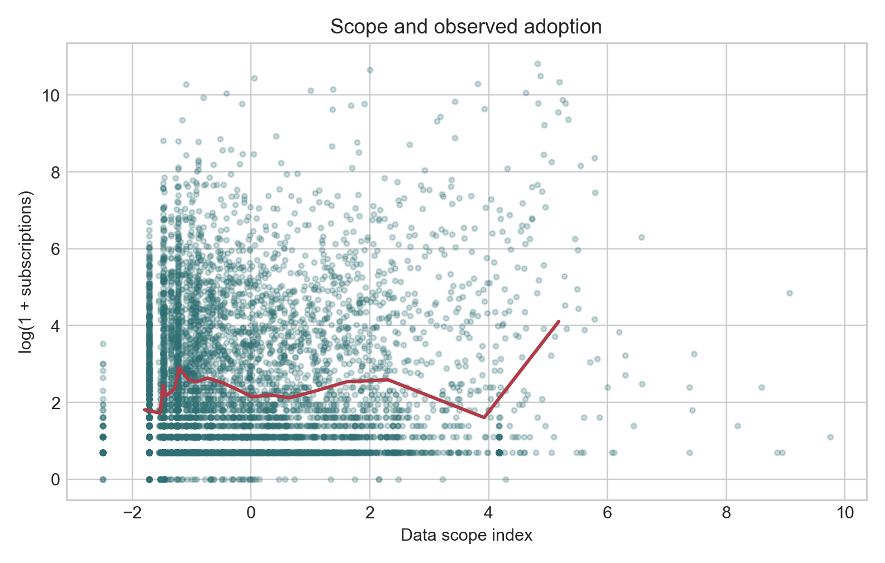
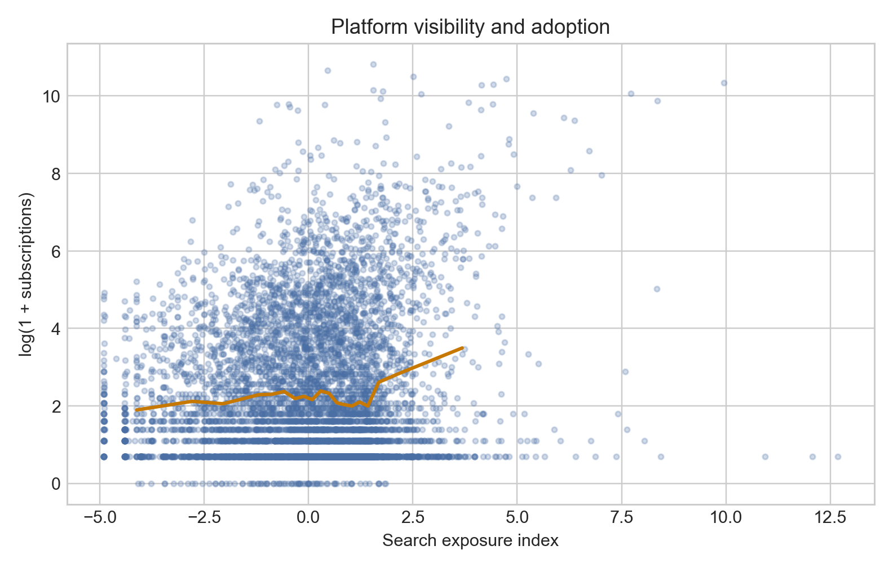
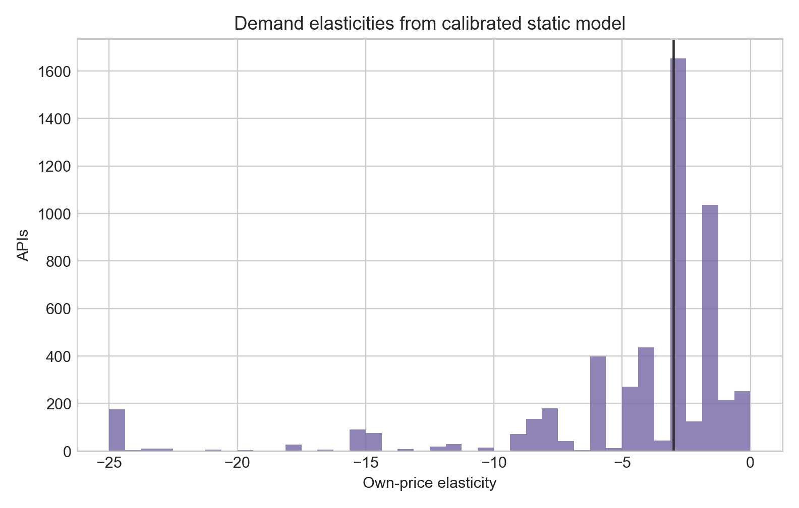
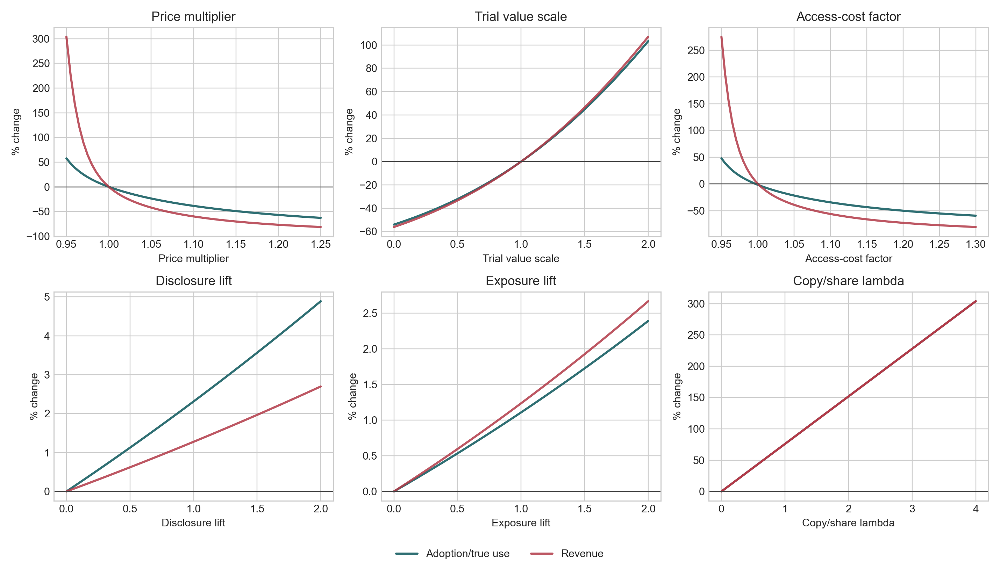

# 摘要

【待写】

# 引言

【待写】

# 文献综述

【待写】

# 理论基准

本文将 RapidAPI 的 Data 市场解释为一个数据访问权市场。卖家交付的是一组可计量、可限速、可撤销、可版本化的 API 访问权。这个对象同时具有三类经济属性。第一，它是差异化产品：不同 API 覆盖的数据源、字段、更新频率、接口稳定性和文档质量不同，买方替代集合由数据类型和用途决定。第二，它是信息商品：复制和再使用的边际成本低，价格表通常通过免费入口、额度、超额费和版本化菜单筛选买方。第三，它是数据商品：同一份数据可被多个买方非竞争性使用，买方还可能把数据复制给组织内部或第三方，因此平台观测订阅数是下游真实使用的下界。

这一设定继承差异化产品 IO 的需求-供给闭环。Berry、Levinsohn 和 Pakes 以及 Nevo 的核心启发是，价格具有内生性；高价格可能同时反映高质量和高市场势力，需求估计需要反演市场份额并处理这种选择。Crawford 和 Yurukoglu 的 bundling 研究说明，数字内容市场中的菜单合同本身是供给选择，版本化应进入模型而非停留在描述层。Gandhi 和 Houde 以及 Conlon 和 Gortmaker 强调，替代模式和工具变量需要来自产品空间和竞争集合。

平台文献给出免费机制和价格结构的解释。Rochet 和 Tirole、Armstrong、Weyl 以及 Hagiu 和 Wright 的共同出发点是，平台价格同时决定总价水平和不同参与阶段之间的价格结构。在 RapidAPI Data 中，免费 plan 把买方购买前学习、卖方筛选和平台转化放在同一合同里。信息商品文献进一步说明为什么菜单重要。Varian、Bakos 和 Brynjolfsson、Sundararajan 以及 Bhargava 和 Choudhary 把低复制成本、版本化、bundling 和非线性定价联系起来；这些机制在 API 市场中表现为调用额度、超额费、endpoint 限制和审批。

数据经济学文献约束了本文的理论贡献。Jones 和 Tonetti 强调数据的非竞争性使用，Bergemann、Bonatti 和 Gan 以及 Acemoglu 等研究说明数据交易会产生外部性和再使用问题，Ichihashi 讨论数据外部性，Agarwal、Dahleh 和 Sarkar 把数据市场设计与定价算法联系起来。本文的增量在于把这些理论对象放进一个静态产业组织框架：产品表现为带合同、试用、计量、访问控制和潜在复制外溢的数据访问权；供给表现为对非竞争性数据的访问治理和价格筛选。

# 数据

样本来自 RapidAPI 的 Data 类 API、公开价格计划、endpoint 静态信息、healthcheck、spotlight、restricted plans、allowed developers 和搜索曝光窗口。产品层是 API，合同层是 plan，功能层是 endpoint/parameter/payload。市场按数据用途划分，包括 web scraping、social/profile、geo/identity、firm/lead、finance/market、ecommerce/price、document/text、real estate/mobility、public/reference 和 other。

| 指标 | 数值 |
|---|---|
| Data API 产品数 | 6974 |
| 公开付费 API 结构样本 | 5360 |
| 数据类型市场数 | 10 |
| owner 数 | 3884 |
| 公开 plan 数 | 21258 |
| endpoint 覆盖 API | 6873 |
| search exposure 覆盖 API | 6974 |
| healthcheck 覆盖 API | 1615 |
| restricted plan API | 134 |
| spotlight API | 928 |

本文构造五组核心变量。数据范围指数综合 endpoint、参数、payload 和 endpoint group，刻画买方能够访问的数据集合。接入复杂度指数综合 route depth、POST 占比和必填参数，刻画接入成本。披露与可验证性指数综合 README、schema、外部文档、服务条款和 OpenAPI spec，刻画购买前质量可观察性。试用和版本化变量来自 plan 菜单，包括免费入口、免费额度、付费层级、价格梯度、额度梯度和超额费。访问治理变量来自审批、restricted plans、allowed developers、endpoint 限制、hard/soft limit 和 rate limit，刻画卖家如何控制非竞争性数据的使用边界。

| 变量 | N | 均值 | 标准差 | P25 | P50 | P75 | P90 |
|---|---|---|---|---|---|---|---|
| 订阅数 | 5360 | 168.670 | 1635.090 | 1.000 | 3.000 | 22.000 | 121.000 |
| 最低月费 | 5360 | 27.846 | 143.915 | 5.000 | 9.990 | 15.000 | 29.990 |
| 免费公开计划 | 5360 | 0.861 | 0.346 | 1.000 | 1.000 | 1.000 | 1.000 |
| 数据范围 | 5360 | 0.219 | 1.848 | -1.230 | -0.320 | 1.164 | 3.631 |
| 接入复杂度 | 5360 | 0.085 | 1.187 | -0.900 | 0.093 | 0.719 | 1.709 |
| 披露指数 | 5360 | 0.171 | 1.465 | -1.034 | -0.471 | 1.290 | 2.479 |
| 可靠性 | 5360 | 0.120 | 1.034 | -0.602 | -0.602 | 1.140 | 1.509 |
| 搜索曝光 | 5360 | 0.371 | 1.554 | -0.518 | 0.481 | 1.283 | 2.018 |
| 试用慷慨度 | 5360 | -0.134 | 1.296 | 0.114 | 0.292 | 0.438 | 0.650 |
| 版本化 | 5360 | 0.785 | 1.034 | 0.332 | 0.942 | 1.151 | 1.692 |
| 限制访问 | 5360 | 0.048 | 1.698 | -0.223 | -0.223 | -0.223 | -0.223 |
| log 免费额度 | 5360 | 3.483 | 2.781 | 1.609 | 3.258 | 4.615 | 6.585 |
| ln_max_paid_quota | 5360 | 11.403 | 2.619 | 10.309 | 12.429 | 13.122 | 13.596 |
| 价格梯度 | 5360 | 2.141 | 1.503 | 1.204 | 2.079 | 2.665 | 3.507 |
| 额度梯度 | 5360 | 3.220 | 2.171 | 1.609 | 2.996 | 4.605 | 5.982 |

图 1 显示数据范围与观测采用之间存在正相关，但这种关系并不机械。范围较低的产品集中在低采用区域，范围较高的产品中既有高采用 API，也有大量长尾 API。这一点很重要：endpoint 多意味着潜在用途更多，也意味着买方需要理解更多字段、处理更多参数、承担更高接入成本。数据范围同时改变用途空间和质量不确定性。后续模型因此同时控制范围、复杂度和披露。

图 2 表明搜索曝光和采用高度相关。这个关系不应被直接解释为平台曝光的因果效应，因为曝光可能由质量、历史采用和平台排序共同决定。它的经验作用是控制买方可见性：如果忽略曝光，采用方程中的声誉、免费计划和文档变量会混入平台排序带来的流量差异。加入曝光变量后，数据范围、试用和披露变量的解释更接近产品与合同本身。

# 模型

市场 $m$ 是数据用途类型，产品 $j$ 是 API，卖家 $f$ 是 owner。买方 $i$ 的间接效用为

$$
u_{ijm} =
\alpha p_j
+ \beta_T T_j
+ \beta_V V_j
+ \beta_S S_j
+ \beta_C C_j
+ \beta_D D_j
+ \beta_R R_j
+ \beta_E E_j
+ X_j\beta
+ \xi_j
+ \varepsilon_{ijm} .
$$

$p_j$ 是最低付费入口价格，$T_j$ 是试用价值，$V_j$ 是版本化菜单，$S_j$ 是数据范围，$C_j$ 是接入复杂度，$D_j$ 是披露与可验证性，$R_j$ 是运行可靠性，$E_j$ 是平台曝光。$\xi_j$ 是买方观察但研究者不能完全观察的质量，例如数据源稀缺性、更新频率、字段准确度和法律风险。

观测订阅数为

$$
q_j^{obs} = subscriptions_j + 1,
\qquad
M_m = \frac{\sum_{j\in m}q_j^{obs}}{0.20},
\qquad
s_j = \frac{q_j^{obs}}{M_m} .
$$

Logit 反演为

$$
\delta_j = \log s_j - \log s_{0m} .
$$

观测订阅数是下界。若买方复制数据给组织内部其他团队或外部用户，真实使用量可写为

$$
q_j^{true} = \kappa_j q_j^{obs}, \qquad \kappa_j \ge 1 .
$$

反事实中令 $\kappa_j$ 随数据范围上升而上升，因为范围更广的数据更容易在多个任务中复用。这一设定把数据商品与普通品区分开：普通品销量通常接近消费数量，数据访问权的购买数量可能低估真实使用规模。

供给侧中 owner 选择价格以最大化

$$
\max_{p_j:j\in\mathcal J_f}
\sum_{j\in\mathcal J_f} M_m s_j(p)(p_j-c_j).
$$

$c_j$ 表示访问治理成本，涵盖服务器调用、数据源维护、清洗更新、失败请求处理、合规审核、客服和复制外溢风险。数据可以无限量复制供应，但访问权并非无成本；成本来自质量维护和使用控制。

一阶条件为

$$
s_j + \sum_{k\in\mathcal J_f}(p_k-c_k)
\frac{\partial s_k}{\partial p_j} = 0,
\qquad
\frac{\partial s_k}{\partial p_j}
= \alpha s_k(1[j=k]-s_j).
$$

# 识别

价格内生性来自未观测质量。更稀缺、更新更稳定、法律风险更低的数据会同时获得更高采用和更高价格。OLS 中价格系数若为正，通常反映质量排序压过了价格敏感性。本文采用四组识别证据。

第一，reduced form 比较同一数据类型内部的采用、价格和免费计划选择，说明数据范围、披露、试用和曝光如何共同刻画市场。第二，plan 内部回归使用 API 固定效应，只比较同一个 API 的不同合同版本，从而识别调用额度、超额费、审批和 endpoint 限制如何进入价格菜单。第三，结构需求使用竞争者特征工具变量；同市场竞争者的免费计划、版本化、数据范围和披露影响本产品均衡价格，但在控制本产品属性和市场固定效应后，不直接进入本产品未观测质量。第四，使用 owner 其他市场策略和合同技术变量作为敏感性识别。owner 跨市场价格和版本化反映卖家定价能力或成本结构；hard/soft limit、rate limit、超额费、endpoint 限制和访问控制反映计量与治理成本。后两组工具变量的排除限制更强，报告中把它们作为辅助证据而非唯一依据。

| 识别来源 | 经济含义 | First-stage F | 评价 |
|---|---|---|---|
| 竞争者特征 | 同市场替代品改变本产品的均衡定价压力。 | 1.598 | 较弱；说明横截面竞争集合不能充分解释价格。 |
| owner 跨市场策略 | 同一卖家在其他数据类型中的定价和版本化反映共同成本或组织能力。 | 21.133 | 较强；但排除限制依赖 owner 策略不直接进入本产品未观测需求。 |
| 合同技术变量 | hard/soft limit、rate limit、超额费和 endpoint 限制反映访问治理成本。 | 8.725 | 中等；最贴近数据访问权的供给侧机制。 |
| 合并工具变量 | 同时使用竞争、seller 和合同治理三类价格 shifter。 | 6.654 | 中等偏弱；作为主规格时需保留弱识别讨论。 |

表中的识别强度本身构成经验结果。竞争者特征工具变量较弱，说明 Data API 的价格并没有被同类产品数量和平均特征机械决定。这个市场存在大量细分用途、长尾产品和 seller-specific 数据源，传统 BLP 工具变量在横截面中提供的信息有限。owner 跨市场策略较强，表明卖家的组织能力、数据源获取能力和定价惯例对价格有系统解释力。合同技术工具变量也有实质相关性，说明价格与访问治理机制相连；hard/soft limit、rate limit、超额费和 endpoint 限制并非无关的页面字段，而是卖家控制非竞争性数据使用边界的供给侧选择。

# Reduced Form

| 变量 | 采用: 基准 | 采用: 数据合同 | 采用: 加平台曝光 | 价格: 付费样本 |
|---|---|---|---|---|
| 免费公开计划 | 0.914*** (0.044) | 0.891*** (0.068) | 0.948*** (0.068) |  |
| log 最低付费月费 | -0.022 (0.016) | -0.057*** (0.018) | -0.063*** (0.017) |  |
| log 公开计划数 | 0.120* (0.068) | 0.533*** (0.150) | 0.496*** (0.147) |  |
| log(1+订阅数) |  |  |  | 0.015 (0.011) |
| 数据范围 |  | 0.112*** (0.011) | 0.104*** (0.010) | -0.020** (0.008) |
| 接入复杂度 |  | 0.013 (0.013) | -0.016 (0.013) | 0.087*** (0.012) |
| 披露指数 |  | 0.094*** (0.013) | 0.042*** (0.013) | 0.064*** (0.010) |
| 可靠性 |  | 0.399*** (0.017) | 0.359*** (0.017) | 0.076*** (0.014) |
| log 免费额度 |  | -0.027*** (0.005) | -0.030*** (0.004) | -0.032*** (0.007) |
| ln_max_paid_quota |  | 0.000 (0.007) | -0.001 (0.007) | 0.044*** (0.009) |
| 版本化 |  | -0.155*** (0.036) | -0.153*** (0.035) | -0.405*** (0.037) |
| 限制访问 |  | -0.003 (0.010) | 0.006 (0.010) | 0.057*** (0.009) |
| 搜索曝光 |  |  | 0.174*** (0.012) | 0.000 (0.011) |
| 平台展示 |  |  | -0.099*** (0.009) | 0.000 (0.007) |
| log API 年龄 | 0.510*** (0.011) | 0.580*** (0.013) | 0.595*** (0.013) | 0.006 (0.012) |
| log owner 全部产品数 | -0.049*** (0.011) | -0.039*** (0.011) | -0.046*** (0.011) | -0.011 (0.010) |
| log 评分票数 | 1.588*** (0.039) | 1.277*** (0.040) | 1.181*** (0.040) | -0.038 (0.023) |
| N: 采用: 基准 | 6974 |  |  |  |
| R-squared: 采用: 基准 | 0.511 |  |  |  |
| N: 采用: 数据合同 |  | 6974 |  |  |
| R-squared: 采用: 数据合同 |  | 0.571 |  |  |
| N: 采用: 加平台曝光 |  |  | 6974 |  |
| R-squared: 采用: 加平台曝光 |  |  | 0.594 |  |
| N: 价格: 付费样本 |  |  |  | 5360 |
| R-squared: 价格: 付费样本 |  |  |  | 0.121 |

采用方程的核心结果是，免费计划、版本化菜单、数据范围、披露、运行可靠性和平台曝光都与订阅数相关。免费计划的正系数支持试用学习机制。数据 API 的买方通常无法在购买前完全知道字段质量、更新频率、缺失率和接口稳定性，免费入口让买方先用少量调用学习质量。这个机制与普通低价促销不同：免费计划提供的是质量实验机会，也让卖家把低强度买方和高强度买方分离。

| 结果 | 系数 | 近似百分比变化 | 解释 |
|---|---|---|---|
| 有免费计划的 API，相对于同类无免费计划 API 的采用差异 | 0.948 | 158.163 | 来自采用方程，控制数据类型固定效应和核心产品/合同变量。 |
| 数据范围指数提高 1 个标准化单位的采用差异 | 0.104 | 10.906 | 来自采用方程，控制数据类型固定效应和核心产品/合同变量。 |
| 披露指数提高 1 个标准化单位的采用差异 | 0.042 | 4.272 | 来自采用方程，控制数据类型固定效应和核心产品/合同变量。 |
| 可靠性指数提高 1 个标准化单位的采用差异 | 0.359 | 43.181 | 来自采用方程，控制数据类型固定效应和核心产品/合同变量。 |
| 搜索曝光指数提高 1 个标准化单位的采用差异 | 0.174 | 19.059 | 来自采用方程，控制数据类型固定效应和核心产品/合同变量。 |
| 评分票数增加约 1 log point 的采用差异 | 1.181 | 225.719 | 来自采用方程，控制数据类型固定效应和核心产品/合同变量。 |
| 免费计划与购买前不确定性的互补性 | 0.737 | 108.960 | 交互项为正表示免费入口在更难验证的数据产品上更有采用价值。 |

经济量级表把主要 log 采用系数转为百分比变化。免费计划的量级最大，说明进入门槛对数据 API 的采用非常关键。这个结果与平台文献中的免费侧机制一致，也与信息商品文献中的试用和版本化一致：当买方在购买前面对质量不确定性时，卖家通过免费入口把“是否值得接入”这个问题变成可实验的问题。搜索曝光的量级同样显著。它说明平台排序并非纯粹背景变量；买方先看到哪些 API，会影响哪些 API 进入候选集合。对长尾数据市场而言，可见性本身是需求形成的一部分。

版本化菜单的正相关说明，合同复杂度本身携带市场信息。一个只有单一价格的 API 很难同时服务一次性调用、持续监控、批量抓取和企业集成。更多付费层级、额度梯度和超额费让卖家在不观察买方真实用途的情况下进行筛选。信息商品文献中的版本化在这里具体体现为调用额度、endpoint 权限、rate limit 和审批。

数据范围的结果需要和复杂度一起读。范围扩大提高潜在用途，因此应当提高需求；复杂度提高接入和维护成本，因此会削弱转化。若只看 endpoint 数，容易把“可用数据更多”和“接入负担更重”混在一起。披露和可靠性变量的作用在于降低购买前不确定性。对数据商品而言，文档、schema、服务条款和 healthcheck 构成买方判断数据是否能进入生产流程的证据。

价格方程显示，采用、付费额度、版本化、访问治理和曝光共同影响最低付费入口价。这个结果说明最低价格是菜单结构中的入口节点。卖家可以通过低入口价吸引试用，也可以通过高额度、超额费和审批把高价值买方引入更高层级。因此，价格解释必须同时读 plan 菜单。

| 变量 | 采用: 试用学习 | 免费计划: LPM |
|---|---|---|
| 免费公开计划 | 1.023*** (0.055) |  |
| 不确定性 | -0.258** (0.109) | -0.005 (0.017) |
| 免费计划 × 不确定性 | 0.737*** (0.090) |  |
| 免费计划 × 接入复杂度 | -0.409*** (0.082) |  |
| 免费计划 × 低披露 | -0.032 (0.047) |  |
| 数据范围 | 0.077*** (0.011) | -0.172*** (0.008) |
| 接入复杂度 | 0.047 (0.092) | 0.043*** (0.013) |
| 披露指数 | 0.189*** (0.028) | -0.020*** (0.007) |
| 可靠性 | 0.566*** (0.032) | 0.045*** (0.007) |
| 版本化 | -0.099*** (0.014) |  |
| 搜索曝光 | 0.193*** (0.012) | 0.006** (0.003) |
| log API 年龄 | 0.625*** (0.012) | 0.023*** (0.002) |
| log owner 全部产品数 | -0.131*** (0.010) | 0.008*** (0.002) |
| log 评分票数 | 0.860*** (0.029) |  |
| N: 采用: 试用学习 | 6974 |  |
| R-squared: 采用: 试用学习 | 0.576 |  |
| N: 免费计划: LPM |  | 6974 |
| R-squared: 免费计划: LPM |  | 0.297 |

试用学习回归进一步显示，免费计划的作用随购买前不确定性变化。若免费计划与不确定性的交互项为正，说明免费入口在更难验证的数据产品上更有价值；若交互项较弱，则说明免费计划更多反映一般流量获取。免费计划选择方程则显示，卖家在更复杂、更不易观察质量的产品上更倾向提供免费入口。这种供需两侧的一致性支持一个更深的解释：免费机制属于数据商品交易中解决质量不确定性的合同设计。

交互项还给出一个重要含义：试用不是对所有产品等比例有效。对于可观察性高、接入简单的 API，买方可以通过文档和字段说明较快判断产品是否匹配；免费入口的边际价值较低。对于字段复杂、质量难以验证、运行可靠性不透明的 API，免费入口把隐藏质量的一部分转化为可观测经验。这个模式把平台免费机制、信息设计和数据经济学中的质量外部性连接起来：卖家通过允许低额度试用向买方释放信息，同时保留对高强度使用的收费权。

# 版本化合同

| 变量 | 同一 API 内 log 月费 |
|---|---|
| log 调用额度 | 0.630*** (0.003) |
| 含超额费 | -0.351*** (0.021) |
| 需审批 | 0.636*** (0.181) |
| 推荐计划 | -0.023*** (0.009) |
| endpoint 级限制 | 0.000 (0.000) |
| 速率限制 | -0.084** (0.042) |
| N | 14443 |
| API fixed effects | demeaned |
| R-squared | 0.892 |

同一 API 内部的 plan 回归给出最直接的版本化证据。API 固定效应吸收了数据源、品牌、owner 和总体质量，因此系数来自同一产品不同合同版本之间的比较。log 调用额度的系数为正且小于一时，说明价格随调用额度上升，但存在数量折扣。这个模式符合信息商品和数据访问权的成本结构：额外调用的边际复制成本低于首个接入合同的固定价值，但高强度使用仍然占用服务、维护和治理资源。

超额费、rate limit、审批和 endpoint 限制反映卖家如何切分使用权。超额费允许卖家保持较低固定费，同时向高强度买方收费；审批把交易从匿名自助转向筛选式合同；endpoint 限制让卖家出售局部数据范围。它们共同说明，数据商品的价格对象是“访问权包”。

# 结构估计

| 变量 | OLS | 2SLS: 竞争者 | 2SLS: owner跨市场 | 2SLS: 合同技术 | 2SLS: 合并 |
|---|---|---|---|---|---|
| 最低付费入口价格 / 100 | 0.050 (0.041) | 0.998 (0.671) | 1.458*** (0.308) | -2.852*** (0.800) | 0.161 (0.193) |
| 免费公开计划 | 0.949*** (0.061) | 1.079*** (0.112) | 1.142*** (0.092) | 0.552*** (0.158) | 0.965*** (0.068) |
| log 免费额度 | 0.034*** (0.008) | 0.048*** (0.013) | 0.055*** (0.010) | -0.008 (0.016) | 0.036*** (0.008) |
| ln_max_paid_quota | -0.008 (0.009) | -0.027* (0.016) | -0.036*** (0.012) | 0.048** (0.022) | -0.010 (0.009) |
| 版本化 | 0.092*** (0.026) | 0.163*** (0.057) | 0.198*** (0.038) | -0.127* (0.075) | 0.100*** (0.029) |
| 任一计划需审批 | -0.750*** (0.227) | -0.984*** (0.302) | -1.097*** (0.290) | -0.034 (0.534) | -0.777*** (0.230) |
| 含超额费 | -0.068* (0.040) | -0.074* (0.042) | -0.077* (0.044) | -0.049 (0.055) | -0.068* (0.040) |
| 限制访问 | 0.041*** (0.015) | 0.029* (0.017) | 0.024 (0.016) | 0.077*** (0.024) | 0.040*** (0.015) |
| 数据范围 | 0.082*** (0.012) | 0.091*** (0.014) | 0.095*** (0.013) | 0.053*** (0.019) | 0.083*** (0.012) |
| 接入复杂度 | -0.026* (0.015) | -0.059** (0.028) | -0.075*** (0.020) | 0.076** (0.036) | -0.030* (0.017) |
| 披露指数 | 0.015 (0.014) | -0.003 (0.019) | -0.012 (0.016) | 0.070*** (0.025) | 0.013 (0.014) |
| 可靠性 | 0.378*** (0.018) | 0.351*** (0.027) | 0.337*** (0.021) | 0.462*** (0.035) | 0.375*** (0.019) |
| 搜索曝光 | 0.152*** (0.014) | 0.155*** (0.015) | 0.157*** (0.015) | 0.141*** (0.019) | 0.152*** (0.014) |
| 平台展示 | -0.116*** (0.009) | -0.117*** (0.009) | -0.118*** (0.010) | -0.110*** (0.013) | -0.116*** (0.009) |
| log API 年龄 | 0.571*** (0.015) | 0.554*** (0.019) | 0.545*** (0.017) | 0.625*** (0.025) | 0.569*** (0.015) |
| log owner 全部产品数 | -0.110*** (0.015) | -0.087*** (0.022) | -0.076*** (0.019) | -0.180*** (0.029) | -0.107*** (0.016) |
| log 评分票数 | 0.861*** (0.031) | 0.874*** (0.032) | 0.880*** (0.032) | 0.821*** (0.043) | 0.862*** (0.031) |
| owner 同市场产品数 | 0.006* (0.003) | 0.005 (0.003) | 0.005 (0.003) | 0.008** (0.004) | 0.006* (0.003) |
| N | 5360 | 5360 | 5360 | 5360 | 5360 |
| R-squared | 0.698 | 0.672 | 0.639 | 0.447 | 0.698 |
| First-stage F |  | 1.60 | 21.13 | 8.73 | 6.65 |

OLS 的价格系数若偏正，反映高质量 API 同时更贵、更受欢迎。工具变量估计的重点在于比较多组识别来源的方向、强度和经济含义。竞争者特征工具变量继承 BLP 思路：竞争集合改变本产品定价压力。owner 跨市场工具变量利用同一卖家在其他数据类型中的价格和版本化策略，捕捉共同成本或组织能力。合同技术工具变量使用 hard/soft limit、rate limit、超额费、endpoint 限制和计量复杂度，捕捉访问治理成本。

第一阶段 F 统计量直接报告识别强度。如果竞争者特征较弱，说明横截面市场内的产品空间尚不足以强力解释价格。Data API 的价格可能更多由访问治理、数据源稀缺性和 seller-specific 合同能力决定。若合同技术工具变量更强，它说明价格主要随计量和控制机制变化。这一发现把模型推向数据商品的特殊性：供给侧的核心对象是访问边界和使用治理。

需求估计中，免费计划、版本化、数据范围、披露、可靠性和曝光的系数共同刻画买方采用过程。免费计划提高试用价值；版本化提高匹配效率；数据范围扩大用途；复杂度提高接入成本；披露和可靠性降低质量风险；曝光影响买方是否看见产品。把这些变量同时放入需求反演，是为了避免把数据商品误写成只有价格和质量的普通差异化产品。

四列 IV 的价格系数并不完全一致，这一点需要直接解读。竞争者 IV 和 owner 跨市场 IV 给出的价格系数仍偏正，说明这些工具变量可能仍带有质量排序或 seller ability 成分；它们更像相关性诊断，而不是单独决定价格弹性的最终证据。合同技术 IV 给出负价格系数，方向与需求理论一致，并且与数据访问权的供给机制最贴近。合并 IV 的价格系数较小且不显著，说明在当前横截面数据中，价格弹性的点估计仍受识别来源影响。本文因此把结构估计用于组织机制和反事实基准，而不把单一价格系数包装成精确因果参数。这个处理更符合高质量 IO 文献的写法：识别强弱、工具变量含义和反事实假设需要一起报告。

# 供给

| 变量 | N | 均值 | P25 | P50 | P75 | P90 |
|---|---|---|---|---|---|---|
| markup_usd | 5360 | 3.332 | 3.330 | 3.330 | 3.330 | 3.332 |
| mc_usd_floored | 5360 | 16.016 | 1.670 | 6.660 | 11.670 | 26.660 |
| own_elasticity | 5360 | -5.776 | -4.505 | -3.000 | -1.502 | -1.498 |
| lerner_index | 5360 | 1.230 | 0.222 | 0.333 | 0.666 | 0.667 |

供给结果将价格分解为 markup 和访问治理成本。中位弹性由校准设为 -3，用于把横截面份额转化为合理的价格敏感性尺度。这个校准把 demand inversion、owner 多产品定价和观测价格连接起来。反推成本中的负值被下界处理，因为数据访问权的会计边际成本不可直接观察，且高质量未观测项可能仍进入价格。

弹性分布显示，长尾 API 和高价专业 API 的需求形态差异很大。长尾产品价格低、份额低，价格变化对采用的影响可能集中在是否尝试；专业产品价格高、替代品少，需求更依赖数据源稀缺性和合同可靠性。这种异质性解释了为什么 reduced form 中价格和采用可能正相关，而结构模型需要处理价格内生性。

# 反事实

| 情景 | adoption_proxy_pct_change | mean_price_usd_pct_change | revenue_proxy_pct_change | inside_share_weighted | true_use_above_observed_pct |
|---|---|---|---|---|---|
| 基准 | 0.0 | 0.0 | 0.0 | 0.157 |  |
| 入口价格提高 10% | -38.58332623230664 | 10.000000000000009 | -59.897995254501325 | 0.097 |  |
| 试用价值减半 | -33.20063282366781 | 0.0 | -34.4467148804034 | 0.105 |  |
| 访问治理成本提高 10% | -34.5327938557513 | 8.871859517486257 | -56.28566063293496 | 0.103 |  |
| 低披露产品提升一档 | 2.3120485215676556 | 0.0 | 1.2761038976327965 | 0.161 |  |
| 低曝光产品提升一档 | 1.1078557390873822 | 0.0 | 1.235557049205549 | 0.159 |  |
| 复制/共享 lambda=1 |  |  |  | 0.157 | 72.93644817072109 |

入口价格反事实沿连续价格倍率改变所有产品价格。采用下降幅度衡量买方对进入价格的敏感性，收入路径则反映价格提高和数量下降之间的权衡。若收入随价格提高下降，说明当前市场更多受采用约束；若收入在一定区间上升，则说明部分产品仍有提高入口价的空间。

试用价值反事实改变免费计划进入效用。去除或削弱试用价值会显著降低采用，说明免费机制在数据市场中承担质量学习功能。增强试用价值则提高采用，但收入变化取决于免费用户是否转化为付费用户。这个反事实对应平台免费机制和信息商品版本化文献：免费侧承担筛选和学习功能。

访问治理成本反事实提高 $c_j$。这里的成本对应维护、清洗、限速、监控、合规和客服。成本上升会推高均衡价格并降低采用。这个路径体现了无限量供应商品的供给特殊性：即使数据可被无限复制，访问权的可靠交付仍然有治理成本。

披露反事实提高低披露产品的信息可验证性。这个反事实模拟更完整的 schema、字段说明、服务条款、healthcheck 或外部文档。若采用上升，说明市场中存在信息摩擦；卖家可以通过披露改善需求，平台也可以通过标准化披露提高匹配效率。

曝光反事实提高低曝光产品的可见性。它改变的是买方搜索集合，并非产品质量。若采用明显上升，说明平台排序和搜索结果是市场分配的一部分。对 RapidAPI 这类市场，需求不只由产品属性决定，也由平台把哪些 API 展示给买方决定。

复制反事实保持平台观测订阅数不变，改变真实下游使用量。随着 $\lambda$ 上升，数据范围越广的 API 拥有越高复制倍率。该路径说明，订阅数低估真实使用并非普通测量误差；它来自数据商品的可复制和可复用属性。同一份数据可以在多个任务、团队和应用中复用。福利和市场规模分析若只看订阅数，会系统低估高范围数据产品的社会使用。

这些反事实的共同含义是，Data API 市场的政策变量和企业策略变量不只包括价格。平台可以通过排序和标准化披露改变匹配效率；卖家可以通过免费额度和版本化菜单改变学习与筛选；访问治理成本会通过均衡价格传导到采用；复制和共享则改变平台观测交易数与真实使用数之间的关系。普通产品市场中的“价格-数量”框架在这里需要扩展为“价格-合同-信息-访问治理-下游复用”的框架。

# 创新点

第一，本文把数据 API 定义为合同化的数据访问权。传统差异化产品模型强调产品质量和价格，本文进一步把 plan 菜单、调用额度、rate limit、endpoint 限制、审批和 allowed developers 放进同一价格对象。这使模型能够解释为什么最低价格、免费入口和付费层级必须一起估计。

第二，本文把数据的非竞争性和可复制性转化为可估计框架中的观测问题。平台订阅数是交易关系数量，不一定是真实使用数量。复制倍率反事实把 Jones-Tonetti 和数据外部性文献中的核心性质连接到 marketplace 数据。

第三，本文把试用机制解释为信息设计。免费计划的价值来自购买前学习，区别于一般促销。披露、healthcheck、schema 和文档共同决定买方能否在付费前评估质量。

第四，本文把供给侧从生产成本改写为访问治理成本。数据可无限复制供应，但可靠、合规、可计量的数据访问权并非零成本。hard/soft limit、rate limit、超额费和审批正是这种治理成本的可观测痕迹。

# 局限

本文仍是静态横截面分析，不能识别 API 上线、排序变化、价格调整和采用动态之间的时间顺序。订阅数是累计或平台展示口径，不能完全等同于当期销量。工具变量的强度和排除限制也不完全相同，报告把多组 IV 作为识别敏感性而非单一最终答案。后续若有每日爬取面板，可以用价格变化、曝光变化和 plan 调整构造更强的动态识别。

# 参考文献

【待并入 BibTeX 与期刊格式】
